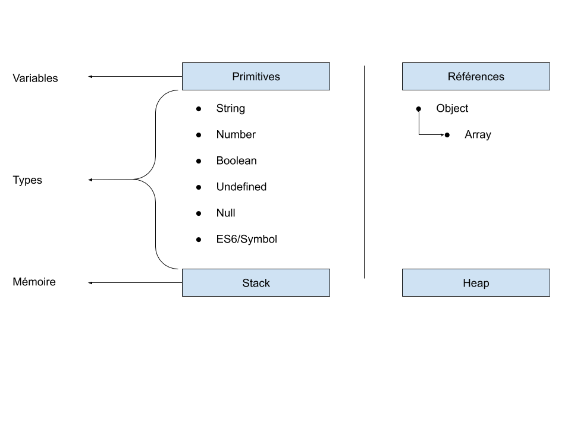

# Gérer les primitives et les références en JavaScript 

Lors de l'écriture des programmes, il est souvent nécessaire d'avoir des variables pour nous permettre de stocker des valeurs.  

Généralement la plupart des développeurs ne font pas attention lorsqu'ils déclarent leurs variables en Javascript et comme tout autre langage, deux classes se distinguent : les primitives et les références. 

Cet article a pour objectif de comprendre la différence entre ces deux variables.  

Avant de commencer, étudions les deux types de mémoire afin de comprendre comment faire la différence entre les primitives et les références.

###Stack & Heap 
Les variables en JavaScript (et dans la plupart des autres langages de programmation) sont stockées à deux endroits : la Stack et la Heap.  

La Stack est généralement une région continue de mémoire allouant un contexte local pour chaque fonction en cours d'exécution. Cette dernière est la plupart du temps, la plus protégée et la plus rapide. 

La Heap, quant à elle, est une région beaucoup plus grande où tout est allouée dynamiquement. Cette séparation est utile pour rendre l'exécution plus sûre face à la corruption.  



## Gérer des Primitives  

La figure ci-dessus montre que toutes les primitives sont stockées avec leurs valeurs dans la Stack.  

Mettons à présent cela en pratique : 
```javascript
var firstPrimitive = 9;

var secondPrimitive  = firstPrimitive ;

console.log('the second primitive equal to : '+ secondPrimitive);
```
https://jsfiddle.net/yg85mwjr/ 

Dans le code au sein du lien ci-dessus, une opération d'affectation sur les primitives permet de faire une copie de valeur au niveau de la Stack.


Maintenant si l’on change la valeur de la première primitive "firstPrimitive", la deuxième primitive sera-t-elle affectée ? Rien ne change puisqu'il existe une copie par valeur au niveau de la Stack.  

```javascript
var firstPrimitive = 9;

var secondPrimitive  = firstPrimitive ; 

console.log('the second primitive equal to : '+ secondPrimitive);

firstPrimitive = 7;

console.log('the first primitive equal to : ' +firstPrimitive);
```

https://jsfiddle.net/92n3bejf/

On peut alors en conclure que lorsqu'il s'agit d'une primitive, une opération d'affectation engendrera une copie par valeur au niveau de la Stack.  

La plupart des développeurs junior savent qu'une simple affectation ne peut rien faire sur la valeur d'une variable. Malheureusement, à ce niveau-là, les problèmes techniques commencent à apparaître car ce comportement au niveau de la Stack n'est valable qu'avec les primitives et non avec les références.

###Gérer des références  
Commençons par une déclaration simple de deux références. Nous découvrirons ensuite l’impact sur la Stack et nous pourrons mieux comprendre les manipulations.  

```javascript
var firstReference = {lat:-34.397, lng:150.644};  

var secondReference = firstReference ;  
```


 On remarque que l’objet “secondReference” a été enregistré dans la mémoire nommée "Heap" avec la même référence que l’objet “firstRefrence” 

Pour avoir accès à notre objet, il faut pointer sur sa référence. Au niveau de la Stack, il existe une copie par référence et les deux objets pointent sur la même référence. Cela entraine un changement de valeur dans le premier objet si le deuxième objet a été modifié et vice-versa puisque les deux objets partagent la même référence.  
```javascript
var firstReference = {lat:-34.397, lng:150.644};

var secondReference = firstReference ; 

secondReference.lng = 0.000;

console.log('secondLng ' + secondReference.lng);
console.log('firstLng  ' + firstReference.lng);
```
https://jsfiddle.net/fan7vxqk/  

On peut conclure que la manipulation des références exige une attention particulière pour ne pas modifier ou muter l’objet de départ.  

Lorsque l’on manipule des services REST, on gère des objets et on manipule des états sans parfois s’apercevoir qu’une action pourrait mettre en danger les états de l’application. 

 

Deux solutions classiques s’offrent à nous pour ne pas utiliser la même référence d'un objet :  

- Créer un nouvel objet qui comporte les mêmes attributs et les mêmes valeurs que le premier objet.  

- Faire une copie d'un objet par une simple opération d'affectation tout en dissociant le couplage entre les deux objets. Javascript offre une méthode qui permet de faire cette manipulation : "Object.assign()" 

Nous aurons au final un nouvel objet ”secondReference”  au niveau de la mémoire Heap et une nouvelle référence différente de celle du "firstRefrence" au niveau de la Stack.  

```javascript
var firstReference = {lat:-34.397, lng:150.644};

var secondReference = Object.assign({},firstReference); 

firstReference.lng = 0.000;

console.log('secondLng ' + secondReference.lng);
console.log('firstLng ' + firstReference.lng);
```
https://jsfiddle.net/6awozefj/

C'est donc très simple ! Pour faire une copie d'un objet, il suffit de faire "Object.assign({},oldObject)" et le tour est joué !   

## Gérer l'imbrication des références 
```javascript
var firstReference = 
{lat:-34.397, lng:150.644, countries:['france','italie','allemagne']};

var secondReference = Object.assign({},firstReference); 

secondReference.lng = 0.000;

secondReference.countries.push("russie");

console.log('secondLng ', secondReference.lng);
console.log('firstLng ', firstReference.lng);
console.log('scondCountriesReference', secondReference.countries); 
console.log('firstCountriesReference', secondReference.countries); 
``` 
https://jsfiddle.net/4vjcsy5a/2/

Dans l'exemple ci-dessus, nous avons cherché à construire un premier objet "firstReference". Celui-ci a ensuite été copié dans un deuxième objet "secondReference" en utilisant la méthode assign(). 

Nous avons ensuite modifié les deux attributs en passant par le deuxième objet “secondReference”.  

Cette modification n’a pas eu d’impact sur l’attribut “lng” qui est resté inchangé tandis que l’attribut countries a été impacté et sa valeur a été modifié. 

On peut conclure que la méthode "assign()" ne pourra pas gérer l'imbrication des références tout simplement parce que l'attribut "countries" est de type tableau (référence) et la méthode "push()" engendre la mutation des variables.  

La méthode "assign()" ne présente pas la meilleure solution car elle ne gère pas l'imbrication des références.


Pour faire une copie complète et gérer l’imbrication, il y a trois solutions possibles:  

1. Faire un clonage superficiel en utilisant la standardisation ECMAScript 2018 (Spread syntax)

    ```javascript
    var clone = {...original}
    ```
    Ci-desous l'implémentation de notre exemple en utilisant le "Spread syntax"
    ```javascript
    var firstReference = {lat:-34.397, lng:150.644, countries:['france','italie','allemagne']}
    var secondReference = {
        ...firstReference,
        countries: [...firstReference.countries, 'russie']
    }
    console.log(firstReference.countries) // ['france','italie','allemagne']
    console.log(secondReference.countries) // ['france','italie','allemagne', 'russie']
    ```

    https://jsfiddle.net/4vjcsy5a/3/

    Attention,l'expression n'est pas encore supportée par tous les navigateurs et pourrait engendrer des erreurs pour votre loader comme BabelLoader ! 

2. Utiliser la librairie lodash.
    ```javascript
    import * as _ from 'lodash'; 
    myObjCopy = _.cloneDeep(myObj);  
    ```

3. Faire parcourir l'objet original.</br>
    Il ne faut jamais oublier que lorsque votre objet original ne contient aucune référence, la méthode Object.assign() est la plus pratique.</br>
    Attention, l'ordre des paramètres de la méthode "Object.assign()" doivent etre respectés.

### Références :
- Stack vs Heap: https://www.quora.com/What-is-the-dif...  

- Object.assign(): https://developer.mozilla.org/en-US/d...  

- Lodash Clone Deep: https://lodash.com/docs/#cloneDeep  

- Spread Properties for ECMAScript :https://developer.mozilla.org/en-US/docs/Web/JavaScript/Reference/Operators/Spread_syntax


